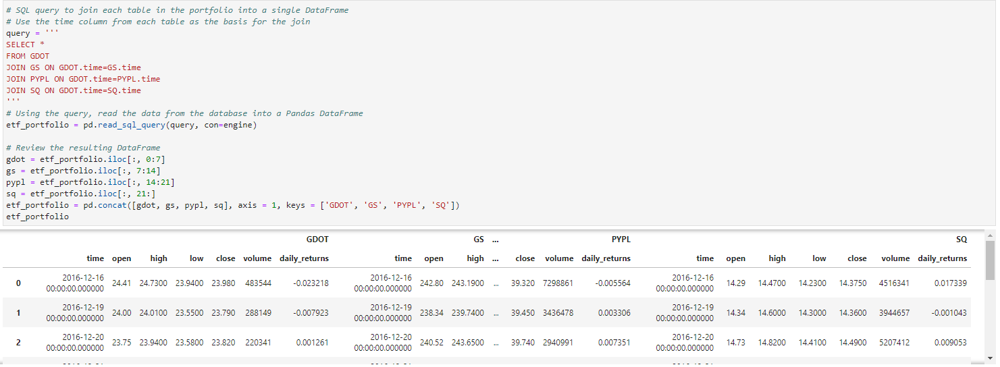
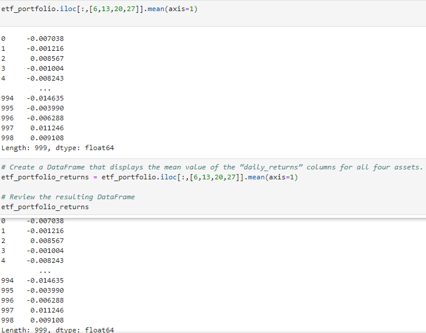
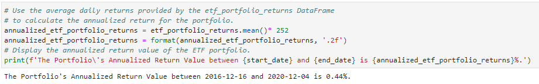
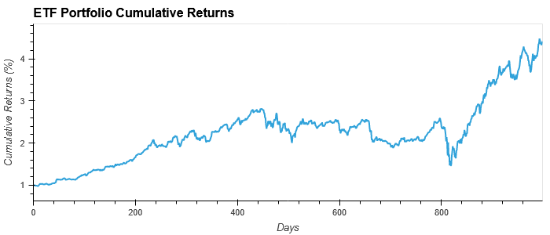

# Passive Investing

This program will analyze the daily retruns of ETF stocks both individually and as a whole. Then deploy visualizations to a web application by using the Voila library.


## Technologies

This project leverages python 3.7 with the following packages:

* [pandas](https://github.com/pandas-dev/pandas) - For DataFrame construction and data sorting.

* [hvplot](https://pyviz-dev.github.io/hvplot/user_guide/Introduction.html) - For data visualization.

* [sqlalchemy](https://docs.sqlalchemy.org/en/14/intro.html) - For database creation.

* [numpy](https://numpy.org/devdocs/index.html) - For scientific computing
---

## Installation Guide

Before running the application first install the following dependencies.


```python
  pip install pandas
  pip install hvplot
  pip install SQLAlchemy
  pip install numpy
```

---


### Analyze a Singel Asset in the ETF

* Step 1:
    - Writing a SQL SELECT statement by using an f-string that reads all the PYPL data from the database. Using the SQL SELECT statement, execute a query that reads the PYPL data from the database into a Pandas DataFrame.


* Step 2:
    - Use the head and tail functions to review the first five and the last five rows of the DataFrame.


* Step 3:
    - Using hvPlot, create an interactive visualization for the PYPL daily returns.


* Step 4:
    - Using hvPlot, create an interactive visualization for the PYPL cumulative returns.


---------------------------------------------------------------------

### Optimize the SQL Queries
## Continue to analyze a single asset (PYPL) from the ETF. Using advanced SQL queries to optimize the efficiency of accessing data from the database.

* Step 1:
    - Access the closing prices for PYPL that are greater than 200. 


* Step 2:
    - Sort data to find top 10 PYPL daily returns.


### Analyze the Fintech ETF Portfolio
## Build the entire ETF portfolio and then evaluate its performance. To do so, build the ETF portfolio by using SQL joins to combine all the data for each asset.


* A SQL query to join each table in the portfolio into a single DataFrame. 
    - Write a SQL query to join each table in the portfolio into a single DataFrame.
<<<<<<< HEAD

=======

>>>>>>> 75d7f4ee4bb320e04ef5146e42aeca792c0a3679

* Create a DataFrame that averages the “daily_returns” columns for all four assets.


* Using the average daily returns in the etf_portfolio_returns DataFrame to calculate the annualized returns for the portfolio. Display the annualized return value of the ETF portfolio.


* Using the average daily returns in the etf_portfolio_returns DataFrame to calculate the cumulative returns of the ETF portfolio. Visualize.


---

## Contributors


*  **Quintin Bland** <span>&nbsp;&nbsp;</span> |
<span>&nbsp;&nbsp;</span> *email:* quintinbland2@gmail.com <span>&nbsp;&nbsp;</span>|
<span>&nbsp;&nbsp;</span> [](https://www.linkedin.com/in/quintin-bland-a2b94310b/)

---

## License

[](LICENSE)
